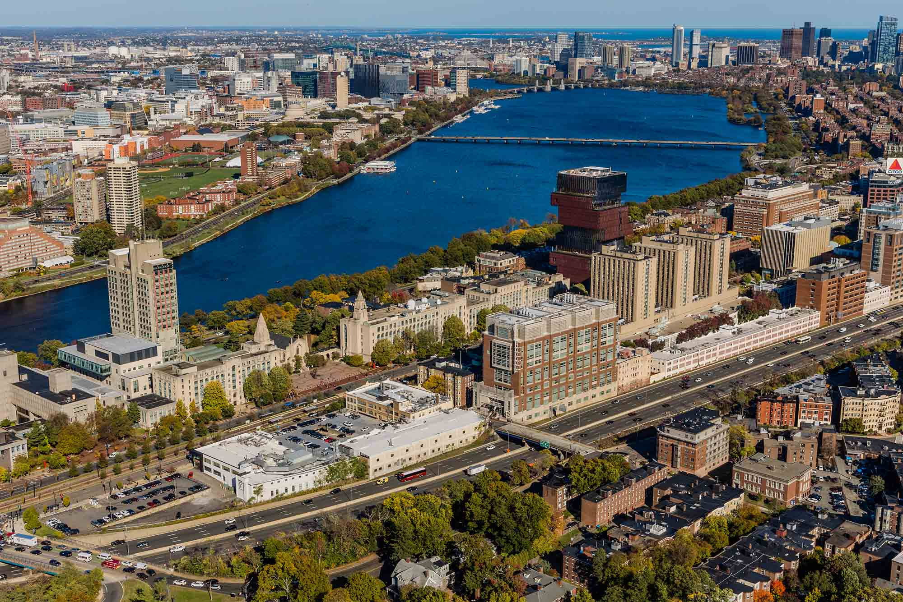

<b>Office Address</b>

Photonics Center, Room 725  8 St. Mary’s Street  Boston, MA 02215 

Email: wangty-at-bu-dot-edu

Phone: 617-353-3251

<b id="interactive-map">Interactive Map</b>

Walking distance zones: ■ 15 min;  ■ 30 min; ■ 45 min.

<iframe src="https://www.google.com/maps/d/embed?mid=1YD5PKIOsHir13bArei9xnGrDVVKYDYE" width="960" height="600"></iframe>

Department of ECE and Photonics Center (the high-rise building around the center of the photo)  
BU Charles River Campus (<a href="https://www.bu.edu/alumni/news/web-cams/">live camera</a>)

<a href="/misc_maps/">More views of Boston and featured maps</a>

