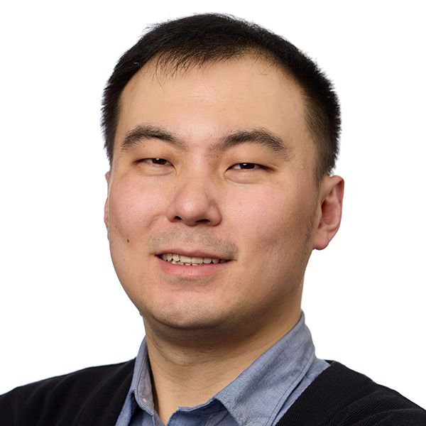
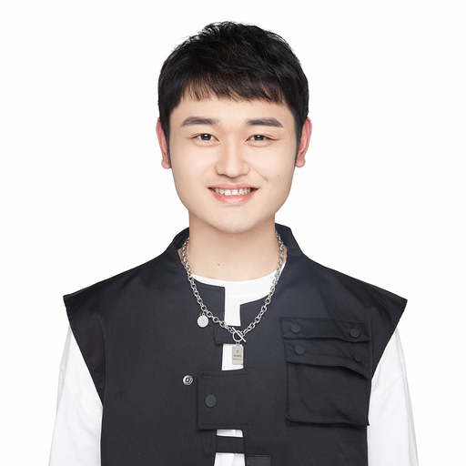
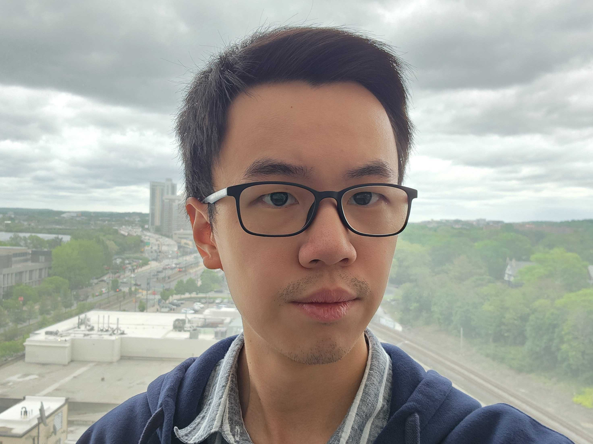
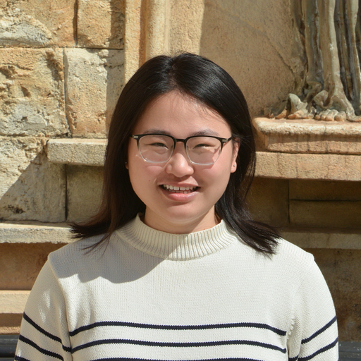
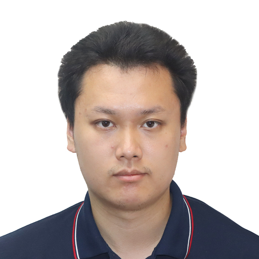
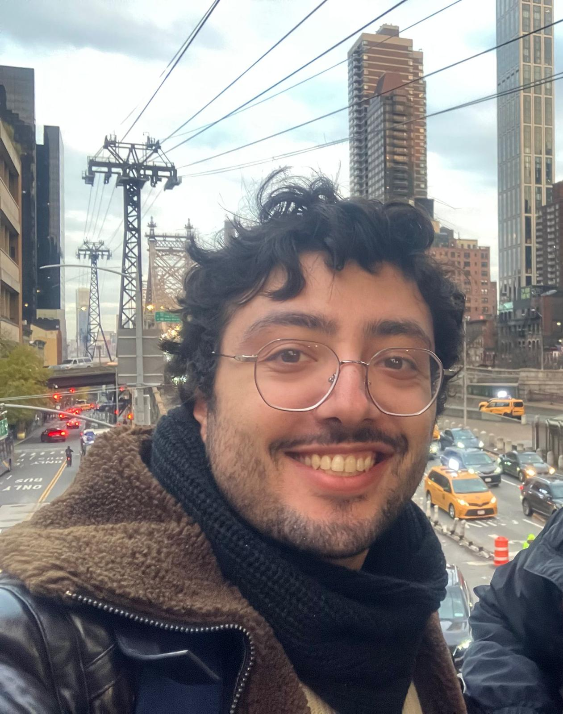
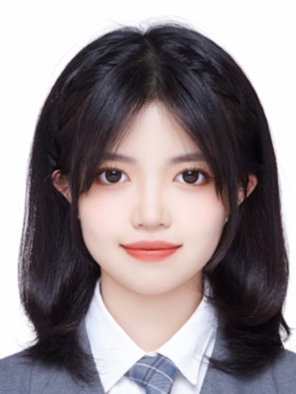
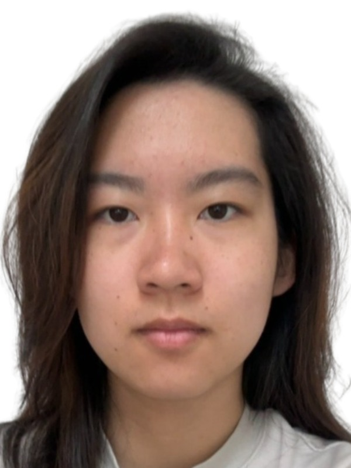

<h1 style="margin-left: -50px;">Team</h1>



<section id="main">
	

		<h2 style="margin-left: -50px;">Principal Investigator</h2>
			

				

					

						
					

					

						Tianyu Wang 
						Assistant Professor 
						Ph.D. in Applied Physics, Cornell University  
						<a href="https://www.bu.edu/eng/academics/departments-and-divisions/electrical-and-computer-engineering/" target="_blank">Department of Electrical & Computer Engineering</a> 
						<a href="https://www.bu.edu/photonics/" target="_blank">Photonics Center</a> | <a href="https://www.bu.edu/neurophotonics/people/faculty/" target="_blank">Neurophotonics Center (NPC)</a> | <a href="https://www.bu.edu/cise/" target="_blank">Center for Information & Systems Engineering (CISE)</a>  
						Email: wangty_AT_bu.edu 
						<a href="https://scholar.google.com/citations?user=_mzQX1EAAAAJ&hl=en" target="_blank">Google Scholar</a> | <a href="https://www.linkedin.com/in/tianyu-wang-44247040" target="_blank">LinkedIn</a>
					

				

			
 

		<h2 style="margin-left: -50px;">Postdoctoral Researchers</h2>
			

				

					

						
					

					

						Weiru Fan 
						Ph.D. in Physics, Zhejiang University, China   
						<b>Research interests:</b> Optical computing; Computational imaging; Light field modulation.  
						<a href="https://scholar.google.com/citations?user=X7_uE2sAAAAJ&hl=zh-TW" target="_blank">Google Scholar</a>
					

				

			
 

		<h2 style="margin-left: -50px;">PhD Students</h2>
			

				

					

						
					

					

						Dingning Li 
						Joined Lab in 2024 
						B.S. in Material Sciences/Physics, Duke Kunshan University, China   
						<b>Research interests:</b> Photonic Integrated Circuits   
						<a href="https://scholar.google.co.uk/citations?user=2y4uRFgAAAAJ&hl=en" target="_blank">Google Scholar</a> | <a href="https://www.linkedin.com/in/dingning-li-02137516a/" target="_blank">LinkedIn</a> 
					

				

			

			

				

					

						
					

					

						Zipei Wu 
						Joined Lab in 2025 
						B.S. in Optoelectronics, Shenzhen University, China   
						<b>Research interests:</b> Biomedical Optics  
					

				

			

			

				

					

						
					

					

						Tianhao Jiang 
						Joined Lab in 2025 
						M.S. in Electrical and Computer Engineering, University of Michigan, Ann Arbor  
						B.S. in Physics, University of Washington, Seattle   
						<b>Research interests:</b> Optical Instrumentation; Physical Modeling.   
					

				

			
 

		<h2 style="margin-left: -50px;">Master's Students</h2>
			

				

					

						
					

					

						Mevlut Gundogan 
						Joined Lab in 2026 
						B.S. in Electrical Engineering at Koç University, Istanbul, Turkey   
						<b>Research interests:</b> Photonic Integrated Circuits and AI Accelerator Hardware.   
						<a href="https://www.linkedin.com/in/mevlut-can-gundogan/" target="_blank">LinkedIn</a> | <a href="https://github.com/mgundogan20/" target="_blank">GitHub</a>
					

				

			
 

		<h2 style="margin-left: -50px;">Undergraduate Students</h2>
			

				

					

						
					

					

						Zitong He 
						Class of 2026 | Computer Engineering  
						Joined Lab in 2024  
						UROP Summer 2025, Fall 2025   
						<b>Research interests:</b> Digital System Design (FPGA)   
						<a href="https://linkedin.com/" target="_blank">LinkedIn</a> | <a href="https://github.com/" target="_blank">GitHub</a>
					

				

			

			

				

					

						
					

					

						Esther Xu 
						Class of 2026 | Electrical Engineering with a minor in Physics  
						Joined Lab in 2025  
						UROP Spring 2026   
						<b>Research interests:</b> Optics and Lasers   
						<a href="https://linkedin.com/" target="_blank">LinkedIn</a> | <a href="https://github.com/" target="_blank">GitHub</a>
					

				

			
 

		<h2 style="margin-left: -50px;">Visitors</h2>

		<h2 style="margin-left: -50px;">Alumni</h2>
			

				
Nolan Vild, Master's Student — M.S., 2025  >>>     
				Legacy: Founding member of the lab; designed and built the first optical neural network based flow cytometer. 

			

			

				
Kit Ng, Master's Student — M.S., 2026   >>>  RF Circuit Designer  
				Legacy: Founding member of the lab; set up the electronics workstation; designed and fabricated the lab’s first circuit board for photodiode arrays; constructed a microfluidic system.  

			

			

				
Yongning Young Ma, Master's Student — M.S., 2025  >>>  Digital Design Engineer, Texas Instruments 
				Legacy: Founding member of the lab; set up the lab server and initiated FPGA programming projects. 

			

			

				
Andrew Sasamori, Undergraduate Researcher — B.S., 2025 

			

			

				
Liam Deighton, Undergraduate Researcher 2025 — Undergraduate at Washington University in St. Louis 
				Legacy: Independently trained machine-learning models predicting visual stimuli based on calcium neuronal imaging data in the mouse brain. 

			

			

				
Nathan Cao, Undergraduate Researcher (NSF REU 2025) — Undergraduate at Rice University 

			

			

				
Shuwen Xue, Undergraduate Researcher (Summer 2025) — Undergraduate at Zhejiang University 
				Legacy: Benchmarked different spatial light modulators and piezoelectric motors; worked on multi-plane light conversion for generating optical angular momentum beams; investigated AI tools for experiment automation.

			

	

</section>
